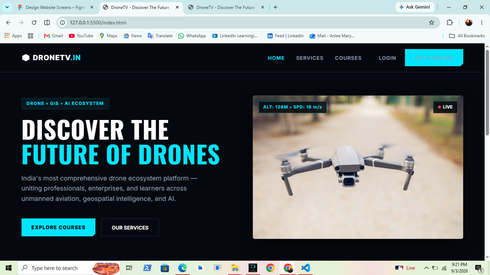
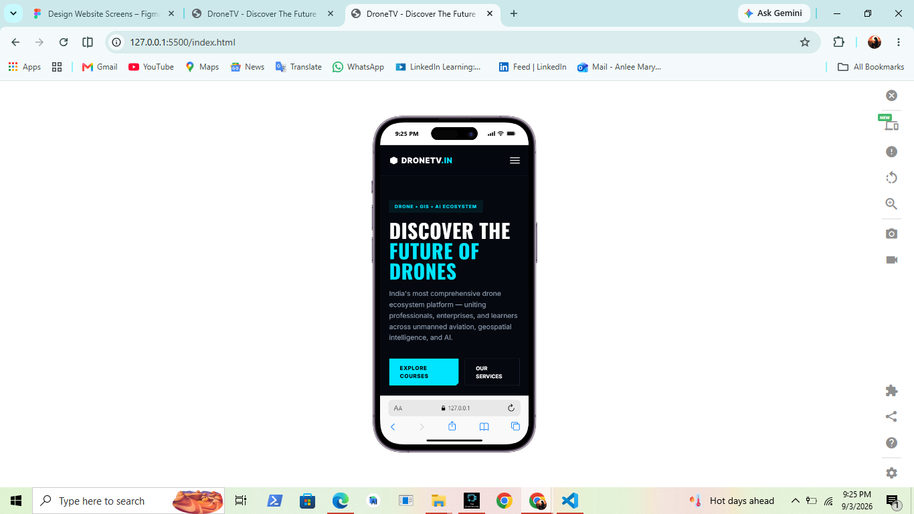

# DroneTV - UI/UX Redesign & Frontend Implementation

A modern, responsive redesign concept and frontend build for **DroneTV.in**, developed as part of the IPAGE Group UI/UX Designer & Frontend Developer Internship practical test assignment.

---

## 🔗 Quick Links

* **Figma Design & Prototype:** [View Design on Figma](https://www.figma.com/make/L1CCkt3av6OffL7odHcLr5/Design-Website-Screens?fullscreen=1&t=UoEIWtheszwZtCBE-1&code-node-id=0-6)
* **Live Demo / Preview:** *(Insert link if deployed on Vercel/Netlify)*

---

## 📌 Project Overview

This project reimagines the DroneTV digital presence with a dark-themed, high-contrast, cyberpunk-inspired visual language (`#070B12` dark background with `#00E5FF` cyan accents). 

### Key Features & Sections
* **Header & Mobile Navigation:** Sticky navbar with clean typography, auth CTAs, and a responsive mobile drawer menu.
* **Hero Section:** Dynamic value proposition featuring real-time flight telemetry indicators and primary action buttons.
* **Impact Metrics Bar:** Displays key statistics (12,000+ Pilots, 340+ Partners, 85+ Certified Courses, 28 States Covered).
* **Core Services & Courses:** Highlighting DGCA-certified training programs, commercial FPV piloting, and enterprise drone solutions.
* **Knowledge Hub / Featured Insights:** Article grid showcasing industry reports, case studies, and technological advancements.
* **Interactive Pilot Auth & Dashboard:** Integrated login/signup state switching leading to a pilot management portal.

---

## 📸 Interface Screenshots

### Desktop View

*Figure 1: Desktop Landing Page & Hero Section*

### Mobile Responsive View

*Figure 2: Mobile Navigation & Responsive Grid Layout*

---

## 🛠️ Tech Stack & Workflow

* **UI/UX Design:** Figma (Auto Layout, Local Styles, Layout Grids)
* **Frontend Architecture:** React, HTML5, CSS3, JavaScript (ES6+)
* **Styling:** Modular CSS variables, CSS Grid, Flexbox, Clips/Polygons
* **Icons & Assets:** Vector SVGs & Custom Graphics

### 🤖 AI-Augmented Development Workflow
To achieve a high-quality, production-ready output within the strict **3-day timeline**, this project utilized an artificial intelligence-assisted workflow:
* **UI Scaffolding:** Generative AI design assistance was used in Figma to rapidly explore spatial layouts, color tokens, and visual hierarchies.
* **Code Structuring:** Synthetic code intelligence assisted in generating semantic layout scaffolding, responsive media query breakpoints, and modular state management logic.

---
